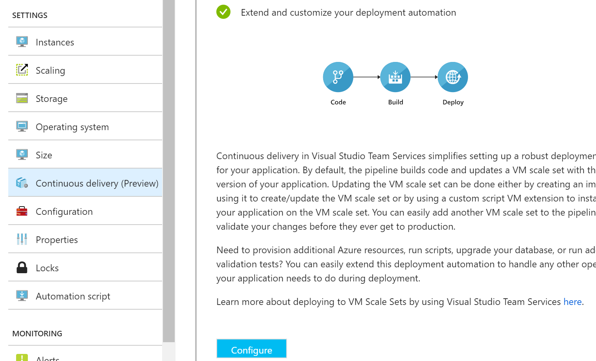
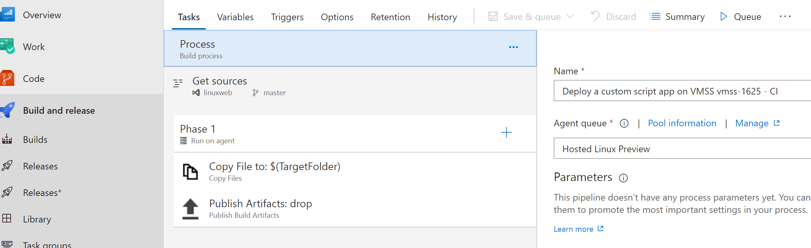
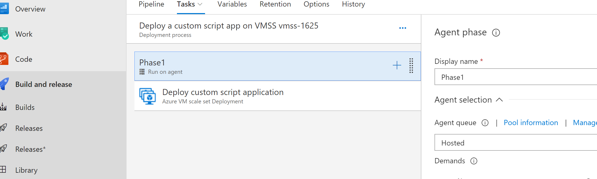

# Continuous Deployment for Azure VM Scale Sets
An example of CD into Scale Sets using update scripts and Visual Studio Team Services (VSTS). The provided script updates the running application by doing a `git pull` on the VMSS virtual machines. 

This allows for an easy set-up of continuous deployment of web apps while leveraging Azure VMSS.

There are other ways of implementing continuous deployment for Scale Sets. [Here's an example](https://docs.microsoft.com/en-us/vsts/pipelines/apps/cd/azure/deploy-azure-scaleset?view=vsts) using [Packer](https://www.packer.io/) and [more examples in the official docs](https://docs.microsoft.com/en-us/azure/virtual-machine-scale-sets/virtual-machine-scale-sets-deploy-app).

# Requirements

* An Azure subcription
* [Azure CLI](https://docs.microsoft.com/en-us/cli/azure/install-azure-cli?view=azure-cli-latest) installed

Make sure you're logged in to the Azure CLI console. Run `az login` if not.

# Getting Started

Fork this repo to your own GitHub account or import to your VSTS account as you'll let to push changes to it to test the pipeline later on. 

To keep it simple, this repo contains the Scale Sets creation scripts and the nodejs web app used as example. It can be used to deploy other applications by changing the git repo in `cloud-init.txt`.

Run the following script and wait a couple of minutes:

`sh create-vmss.sh <resource_group_name>` 

This creates a resource group and the scale set and returns the public IP of the scale set and inbound NAT rules: 

```
Getting public IP vmss-cd2LBPublicIp
23.97.210.147

Getting inbout NAT rules
22      50000
22      50003
```

You can check that the website is running by browsing to the public IP. 

Also, if you need to ssh to the VMs, you can specify the port from the NAT rules above. E.g.:

`ssh <user>@23.97.210.147 -p 50000`

# Setting up Continuous Deployment

Browse to the created VM Scale Set on the Azure Portal and click on Continuous Delivery (preview).



Proceed as below:

* **Source Code**
  * Choose your VSTS or GitHub repo where the website to deploy is hosted (Note that the update script must be on that repo)
  * Choose the branch that will trigger the build/release pipeline (eg: master)   
* **Team Services Organization**
    * Select a new or existing project in VSTS where the build/release pipeline will be created
* **Deploy**
    * Choose Linux or Windows depending on which OS the Scale Set is running
    * In Deployment Package, specify the root folder of the website (eg: ./www). This should also contain the update script
    * In Deployment Script, specify the update script to use (eg: update.sh). Path is relative to the deployment package above
    * Select the Azure Storage account where the created artifacts (eg: .tar.gz files) will be stored. You will most likely not need to access these files.

**IMPORTANT**: Once the build/release pipeline is created in VSTS, you may need to change the agents to match the OS in use, or else you'll most likely get EOL or permission errors. **When using Linux**, specify as follows:

* **Build Process agent queue:** Hosted Linux (Preview)
* **Release Phase1 agent queue:** Hosted


_(Image: Build agent)_


_(Image: Release agent)_

# Testing the pipeline

Modify/add a file and push it to the master branch (or whatever branch you specified before). The resulting changes should be applied to all the VMSS virtual machines in a few seconds. You can see logs and customize the build/release pipeline in VSTS. 

Remember that, if necessary, you can ssh to the Scale Set VMs for further debugging.

# Notes

* While this example uses a nodejs with an nginx reverse proxy, you can use whatever stack works for you.

# Feedback

Open an issue here or find [@theplastictoy](https://twitter.com/theplastictoy) on Twitter.


